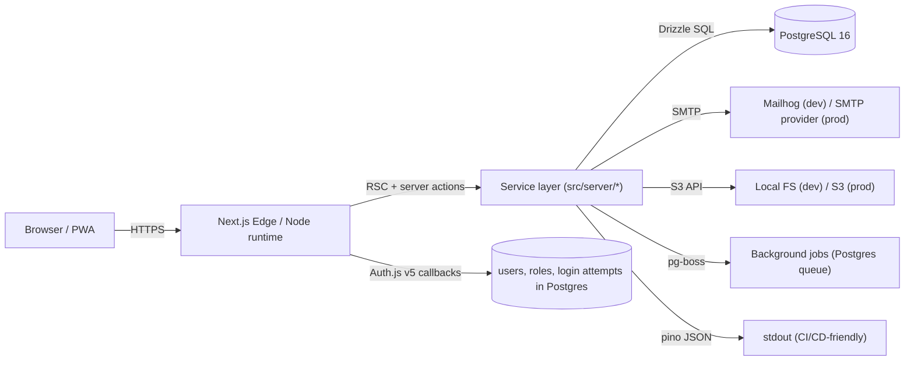

# Architecture decision record — Sensei Modern

## 1. Goals

- Fast on mobile, fast on Wi-Fi, snappy on slow networks.
- One TypeScript codebase, no frontend ↔ backend impedance mismatch.
- Strong data integrity for a relational, append-only-history domain.
- Cross-platform local dev (macOS + Windows + Linux).
- Self-host friendly and Vercel-deployable.
- No vendor lock-in for the database or auth.
- Production-minded from day one: tests, logging, audit trails, RBAC.

## 2. Stack at a glance

| Layer              | Choice                                                                                | Why                                                                                  |
| ------------------ | ------------------------------------------------------------------------------------- | ------------------------------------------------------------------------------------ |
| Frontend framework | **Next.js 15 App Router**                                                             | RSC + server actions = small client bundles, shared TS, edge-ready, mature ecosystem |
| Language           | **TypeScript strict**                                                                 | Catches schema/contract bugs at build time                                           |
| UI library         | **Tailwind CSS 3 + shadcn/ui** (Radix primitives)                                     | Accessible by default, ownable code, no peer-version lock                            |
| State / forms      | **React Hook Form + Zod**                                                             | Tiny, fast, server-action-friendly                                                   |
| API style          | **RSC + server actions + thin route handlers**                                        | One mental model; route handlers only for webhooks/exports                           |
| Database           | **PostgreSQL 16**                                                                     | Relational domain (see §4)                                                           |
| ORM                | **Drizzle ORM**                                                                       | TS-native, no shadow DB, fast cold starts; Prisma is a fallback                      |
| Auth               | **Auth.js v5**, Credentials provider, Argon2id hashing, JWT sessions + DB-backed RBAC | Self-hostable, no vendor lock                                                        |
| File storage       | Abstract `Storage` adapter (local FS in dev, S3-compatible in prod)                   | Cheap dev, swappable in prod                                                         |
| Email              | nodemailer + SMTP. Mailhog in dev                                                     | Provider-agnostic                                                                    |
| Background jobs    | **pg-boss** (Postgres-backed)                                                         | No Redis needed for v1; one less service to operate                                  |
| Logging            | **pino** (JSON), pino-pretty in dev                                                   | Structured, OTLP-exporter-ready                                                      |
| Testing            | **Vitest** (unit) + **Playwright** (e2e)                                              | Fast, parallel, modern                                                               |
| Dev infra          | **Docker Compose** (Postgres + Mailhog)                                               | Cross-platform                                                                       |
| Package manager    | **pnpm** via Corepack                                                                 | Fastest installs, strict isolation                                                   |

## 3. High-level diagram



## 4. Database choice: **PostgreSQL** (rejecting MongoDB)

The owner asked us to evaluate MongoDB before defaulting. We did, and we
recommend PostgreSQL.

### Why the domain is relational

- **Members ↔ guardians** is many-to-many (one guardian can have multiple
  children; one minor may have two guardians).
- **Members ↔ ranks** is one-to-many history (a member has many rank
  entries over time; the "current rank" is the most recent active row).
- **Members ↔ attendance** is one-to-many at scale (tens of thousands of
  rows per year per org).
- **Classes ↔ instructors** is many-to-many.
- **Payments ↔ members** is one-to-many ledger.
- **Promotions** are a workflow with referential integrity to ranks,
  members, and approvers.

### Reports the org will want immediately

- Attendance % per student per term/quarter (needs joins + group-by).
- Rank progression timeline (window functions over `ranks` per member).
- Revenue per dojo per month (sums + group-by + filter on `deleted_at`).
- Overdue payments (left joins + interval math).
- "Active vs inactive members" (partial indexes + boolean predicates).

All of these are textbook SQL. PostgreSQL gives them to us with one query
and stable plans. MongoDB makes them aggregation-pipeline gymnastics.

### What PostgreSQL gives us that we'll lean on

- Referential integrity (no orphan attendance rows).
- `CHECK` constraints (e.g., `payment.amount >= 0`).
- Partial indexes (e.g., `WHERE deleted_at IS NULL` for hot active sets).
- Generated columns / views for read models (e.g., `members_active_v`).
- Strong transactional semantics for promotion approvals.
- `pg_trgm` for fuzzy member search.
- Backup/restore is `pg_dump` — boring and reliable.
- Local-dev parity: Postgres in Docker = production in any cloud.

### When MongoDB would beat Postgres

If the central document were a sprawling, deeply-nested, schema-fluid
member profile that almost never cross-references other entities, and
ad-hoc reporting weren't a requirement. That is **not** this domain.

### Decision

**PostgreSQL 16.** Locked in. If a single feature later needs a document
store (e.g., flexible per-org form definitions), we'll add a `jsonb`
column or a small key-value store, not switch the primary database.

## 5. ORM choice: **Drizzle**

| Criterion                         | Drizzle         | Prisma          |
| --------------------------------- | --------------- | --------------- |
| TS-native query builder           | ✅ direct types | ⚠️ codegen step |
| Cold start                        | Fast            | Slower (engine) |
| Schema as code                    | ✅ pure TS      | ✅ DSL          |
| Shadow DB required for migrations | ❌              | ✅              |
| SQL escape hatch                  | First-class     | Limited         |
| Maturity for production           | Good in 2026    | Mature          |
| Edge runtime                      | ✅              | Partial         |

Drizzle's lightweight, schema-as-TS approach matches the team's TS-first
preference and avoids Prisma's codegen + engine overhead in serverless
runtimes. If a future contributor objects, swapping to Prisma is a
mechanical refactor — schemas are colocated under `src/db/schema/`.

## 6. Authentication & authorization

### Authentication

- **Auth.js v5** with **Credentials provider**: accepts email **or** phone
  (preserving legacy UX). Server-side, the identifier is normalized:
  - Email: trimmed, lowercased.
  - Phone: parsed with `libphonenumber-js` to E.164, default region MX.
- Passwords hashed with **Argon2id** (`argon2` package).
- **JWT sessions** via Auth.js. The session callback rehydrates the user
  and role assignments from Postgres on each session read, which keeps
  RBAC changes fresh. Forced session revocation remains a v1.1 hardening
  item unless the app moves to database sessions.
- Cookie: `__Secure-` prefix in prod, `SameSite=Lax`, `HttpOnly`.

### Password policy

- Min 10 chars, no max, breach-checked against a local blocklist for v1
  (HIBP API in v1.1).
- Rate-limited login (IP + identifier) via a `login_attempt` table. The
  table stores HMAC hashes of the normalized identifier and client IP,
  not the raw values.

### Authorization

- Roles are **(user_id, organization_id, dojo_id|null, role)** tuples.
- Server-side guard: `requireRole(roles[], { orgId, dojoId? })` throws
  `Forbidden` and returns a typed action error.
- A `withOrg<T>(fn, { orgId })` helper wraps any data fetch and asserts
  the caller has access — multi-tenant safety by construction.
- The Members module ships as the reference implementation.

### MFA

Out of scope for v1.0 but the data model has a `mfa_enabled` flag and
`auth_factor` table to keep the door open for TOTP in v1.1.

## 7. File storage

A pluggable `Storage` interface:

```ts
interface Storage {
  put(key: string, body: Buffer, opts: { contentType?: string }): Promise<{ url: string }>;
  get(key: string): Promise<Buffer>;
  remove(key: string): Promise<void>;
  signedUrl(key: string, ttlSeconds: number): Promise<string>;
}
```

- `STORAGE_DRIVER=local`: writes to `./.uploads`, served via a guarded
  route handler `/api/files/[key]`.
- `STORAGE_DRIVER=s3`: AWS S3 / Cloudflare R2 / MinIO — anything with the
  S3 API.

## 8. Email / notifications

- nodemailer + SMTP everywhere. Dev uses Mailhog at `mailhog:1025`.
- All templates live in `src/server/email/templates/*.tsx` (React Email).
- Outbound delivery is enqueued via pg-boss so transient SMTP failures
  retry without blocking a request.

## 9. Background jobs

- **pg-boss** queues stored in the same Postgres DB.
- Initial jobs: send email, generate report PDF (v1.1).
- Worker is a separate Node process started by `pnpm jobs:dev` in v1.1.

## 10. Deployment

- **Self-host**: `docker compose --profile full up -d` runs the app +
  Postgres + Mailhog in a single host.
- **Vercel**: app deploys directly; supply a managed Postgres
  (Neon/Supabase/RDS) URL via env var.
- DB migrations run as a deploy step (`pnpm db:migrate`).

## 11. Local development

- Required tooling: **Node 20+** (we test on 20 LTS and 22), **pnpm** via
  Corepack, **Docker Desktop** (macOS / Windows) or Docker Engine
  (Linux).
- `pnpm db:up` boots Postgres + Mailhog. `pnpm db:migrate && pnpm db:seed`
  fills the DB. `pnpm dev` runs the app on `http://localhost:3000`.
- All scripts are pnpm tasks — no `bash`-only helpers.

## 12. Testing strategy

| Layer         | Tool                         | What it covers                                                                                        |
| ------------- | ---------------------------- | ----------------------------------------------------------------------------------------------------- |
| Unit          | Vitest                       | Pure functions: RBAC checks, zod schemas, phone/email normalization, query builders against a temp DB |
| Integration   | Vitest                       | Server actions against a real Postgres in CI (testcontainers in v1.1)                                 |
| End-to-end    | Playwright                   | Critical paths: login, members CRUD, attendance roll-call                                             |
| Visual / a11y | Playwright + axe-core (v1.1) | Per-route a11y assertions                                                                             |

## 13. Security model

- Every protected route is inside the `(app)` route group, guarded by
  middleware that requires a session.
- All server actions validate input with Zod before any DB call.
- Every mutation calls `auditLog.record(...)` inside the same
  transaction.
- Outbound HTTP is on an explicit allowlist.
- Cookies are `HttpOnly`, `SameSite=Lax`, `Secure` in prod.
- Baseline security headers are set in `next.config.ts`
  (`X-Frame-Options`, `X-Content-Type-Options`, `Referrer-Policy`, and
  `Permissions-Policy`). CSP is planned but not enabled yet.
- `.env.local` is gitignored; production secrets come from the host
  (Vercel env vars / Docker secrets / SOPS).

## 14. Observability

- `pino` JSON logs to stdout. Each request gets a `requestId` correlated
  to server-action calls.
- Health endpoint at `/api/health` returns status, DB availability, and
  timestamp. DB failure details are written to server logs, not returned
  in the public JSON response.
- OTLP exporter scaffold ready (off by default) so the operator can
  point at Honeycomb / Tempo / Datadog later.
- Audit log table is queryable by org admin via Reports → Audit.

## 15. Future-proofing decisions made now

- Schemas are namespaced under `src/db/schema/*` (one file per entity)
  so adding a new module is "drop a file + write a migration".
- The Members module is the **reference layout** — every new module
  copies its structure (`page.tsx` list + `[id]/page.tsx` detail +
  `actions.ts` server actions + `schemas.ts` zod + `queries.ts` Drizzle
  queries + tests).
- i18n keys are namespaced per module (`members.list.title`). The
  public website may render Spanish or English; login and protected
  management routes remain Spanish-only even though message files exist
  for maintainer QA.
